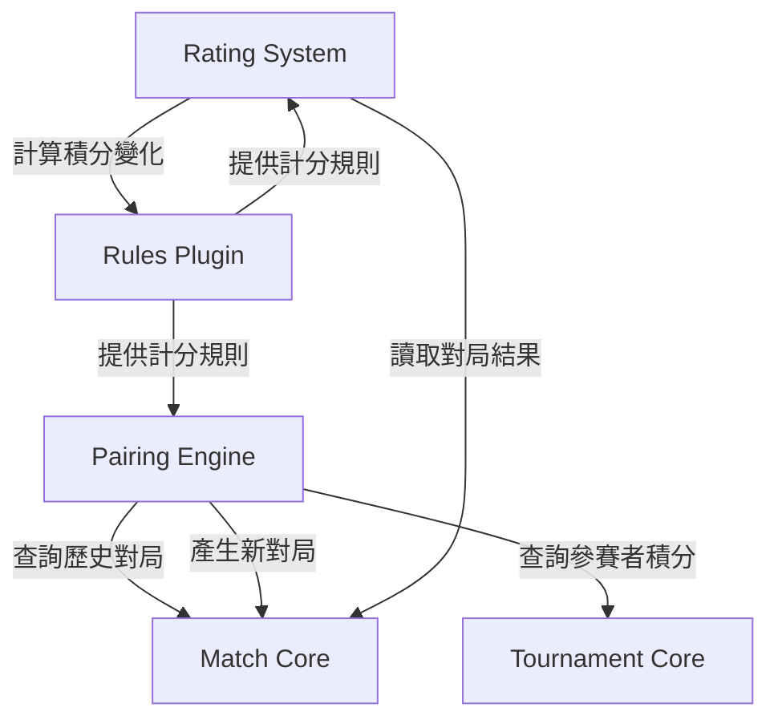

# 瑞士制配對與 ELO 等級分系統規劃

## 一、系統架構概覽

本規劃將建立兩個獨立但相關的子系統：

1. **瑞士制配對引擎**：位於 `packages/pairing/`
2. **ELO 等級分系統**：位於 `packages/rating/`

兩者均遵循現有的多棋種外掛設計（`GameKey` + `rulesetVersion`），與核心 `Tournament`/`Match` 模型整合，但不侵入其責任邊界。




## 二、瑞士制配對系統

### 2.1 資料模型擴充

**新增資料表**：`db/schema/pairing.sql`

```sql
-- 編排配置（每個賽事可有不同配對策略）
create table if not exists pairing_configs (
  id uuid primary key default gen_random_uuid(),
  tournament_id uuid not null unique references tournaments(id) on delete cascade,
  strategy text not null default 'basic_swiss', -- basic_swiss/dutch/dubov
  color_balance boolean not null default true,
  avoid_rematches boolean not null default true,
  -- tiebreak 優先順序（JSON 陣列）
  tiebreak_order jsonb not null default '["wins", "head_to_head", "opponent_score"]',
  created_at timestamptz not null default now(),
  updated_at timestamptz not null default now()
);

-- 編排歷史（記錄每輪配對產生的過程與參數）
create table if not exists pairing_rounds (
  id uuid primary key default gen_random_uuid(),
  tournament_id uuid not null references tournaments(id) on delete cascade,
  round_no int not null,
  strategy_used text not null,
  participants_count int not null,
  -- 配對時的積分快照（用於審計與除錯）
  standings_snapshot jsonb not null,
  paired_at timestamptz not null default now(),
  paired_by uuid references users(id),
  constraint uq_pairing_round unique (tournament_id, round_no)
);

-- Bye 輪（奇數人輪空記錄）
create table if not exists pairing_byes (
  id uuid primary key default gen_random_uuid(),
  tournament_id uuid not null references tournaments(id) on delete cascade,
  round_no int not null,
  player_id uuid not null,
  reason text, -- odd_player/late_arrival/manual
  created_at timestamptz not null default now()
);
```

### 2.2 核心模組：`packages/pairing/`

**檔案結構**：

```
packages/pairing/
├── src/
│   ├── index.ts              # 主入口
│   ├── types.ts              # 型別定義
│   ├── engines/
│   │   ├── basic-swiss.ts    # 基礎瑞士制
│   │   ├── dutch.ts          # 荷蘭制（Phase 2）
│   │   └── dubov.ts          # Dubov 系統（Phase 2）
│   ├── tiebreaks/
│   │   ├── basic.ts          # 勝負場次、直接勝負
│   │   ├── opponent-score.ts # 對手分（Buchholz）
│   │   ├── cumulative.ts     # 累進分
│   │   └── sonneborn-berger.ts # SB 係數
│   ├── validator.ts          # 配對合法性檢查
│   └── bye-handler.ts        # 輪空處理
├── package.json
└── tsconfig.json
```

**核心 API**：

```typescript
// types.ts
export type PairingStrategy = 'basic_swiss' | 'dutch' | 'dubov';

export type TiebreakMethod = 
  | 'wins'              // 勝場數
  | 'head_to_head'      // 直接勝負
  | 'opponent_score'    // 對手分（Buchholz）
  | 'cumulative'        // 累進分
  | 'sonneborn_berger'  // SB 係數
  | 'opponent_opponent' // 對手的對手分
  | 'games_as_black';   // 黑棋局數（圍棋/西洋棋）

export type PairingConfig = {
  strategy: PairingStrategy;
  colorBalance: boolean;
  avoidRematches: boolean;
  tiebreakOrder: TiebreakMethod[];
};

export type PairingInput = {
  tournamentId: string;
  roundNo: number;
  participants: Array<{
    playerId: string;
    currentPoints: number;
    matchHistory: Array<{ opponentId: string; color?: 'A' | 'B' }>;
  }>;
  config: PairingConfig;
};

export type PairingOutput = {
  pairs: Array<{
    playerAId: string;
    playerBId: string;
    tableNo: number;
  }>;
  byes: string[]; // 輪空選手
  standings: StandingsRow[]; // 配對前排名快照
};

// index.ts
export async function generatePairing(input: PairingInput): Promise<PairingOutput>;
export function computeTiebreaks(standings: StandingsRow[], method: TiebreakMethod, matches: FinishedMatch[]): StandingsRow[];
```

**基礎瑞士制算法**（`engines/basic-swiss.ts`）：

```typescript
export function basicSwissPairing(input: PairingInput): PairingOutput {
  // 1. 按當前積分分組（同分組）
  const groups = groupByPoints(input.participants);
  
  // 2. 在每組內隨機配對（避免重複對局）
  const pairs: Pair[] = [];
  const unpaired: string[] = [];
  
  for (const group of groups) {
    const { paired, bye } = pairWithinGroup(
      group,
      input.config.avoidRematches
    );
    pairs.push(...paired);
    if (bye) unpaired.push(bye);
  }
  
  // 3. 處理跨組配對（若組內人數為奇數）
  const finalPairs = handleCrossGroupPairing(pairs, unpaired, groups);
  
  // 4. 分配桌號
  assignTableNumbers(finalPairs);
  
  return {
    pairs: finalPairs,
    byes: unpaired,
    standings: computeStandings(input.participants)
  };
}
```

### 2.3 Tiebreak 模組

**對手分（Buchholz）實現**（`tiebreaks/opponent-score.ts`）：

```typescript
export function computeOpponentScore(
  standings: StandingsRow[],
  matches: FinishedMatch[]
): StandingsRow[] {
  const pointsMap = new Map(standings.map(s => [s.playerId, s.points]));
  
  return standings.map(row => {
    // 計算該選手所有對手的總分
    const opponents = matches
      .filter(m => m.playerAId === row.playerId || m.playerBId === row.playerId)
      .map(m => m.playerAId === row.playerId ? m.playerBId : m.playerAId);
    
    const opponentScore = opponents.reduce(
      (sum, oppId) => sum + (pointsMap.get(oppId) ?? 0),
      0
    );
    
    return {
      ...row,
      tiebreaks: {
        ...row.tiebreaks,
        opponent_score: opponentScore
      }
    };
  });
}
```

### 2.4 與現有系統整合

**API 端點**（`apps/api/src/pairing/`）：

```typescript
// POST /api/tournaments/:id/rounds/:roundNo/generate-pairing
// 觸發條件：Tournament.status === 'pairing_ready' || 'in_progress'
// 權限：TournamentRole.role === 'organizer' || 'staff'

async function generatePairing(req, res) {
  const { tournamentId, roundNo } = req.params;
  
  // 1. 檢查賽事狀態與權限
  await checkTournamentStatus(tournamentId, ['pairing_ready', 'in_progress']);
  await checkUserRole(req.userId, tournamentId, ['organizer', 'staff']);
  
  // 2. 取得配對配置
  const config = await getPairingConfig(tournamentId);
  
  // 3. 取得參賽者與歷史對局
  const participants = await getParticipants(tournamentId);
  const matches = await getMatchHistory(tournamentId, roundNo - 1);
  
  // 4. 執行配對
  const result = await generatePairing({
    tournamentId,
    roundNo,
    participants,
    config
  });
  
  // 5. 寫入 Match 與 PairingRound
  await createMatches(tournamentId, roundNo, result.pairs);
  await savePairingRound(tournamentId, roundNo, result);
  
  return res.json(result);
}
```

## 三、ELO 等級分系統

### 3.1 資料模型

**新增資料表**：`db/schema/rating.sql`

```sql
-- 等級分配置（每個棋種可有不同設定）
create table if not exists rating_configs (
  id uuid primary key default gen_random_uuid(),
  game_key game_key not null unique,
  default_rating int not null default 1500,
  k_factor_base int not null default 32,
  -- K-factor 分級規則（JSONB，支援彈性配置）
  k_factor_tiers jsonb not null default '[
    {"rating_below": 2000, "k": 40},
    {"rating_below": 2400, "k": 32},
    {"rating_above": 2400, "k": 24}
  ]',
  min_rating int not null default 100,
  max_rating int null,
  created_at timestamptz not null default now(),
  updated_at timestamptz not null default now()
);

-- 棋手等級分（每個棋種獨立）
create table if not exists player_ratings (
  id uuid primary key default gen_random_uuid(),
  player_id uuid not null references users(id) on delete cascade,
  game_key game_key not null,
  current_rating int not null,
  peak_rating int not null,
  lowest_rating int not null,
  games_played int not null default 0,
  wins int not null default 0,
  draws int not null default 0,
  losses int not null default 0,
  last_calculated_at timestamptz null,
  created_at timestamptz not null default now(),
  updated_at timestamptz not null default now(),
  constraint uq_player_game_rating unique (player_id, game_key)
);

-- 等級分歷史（追蹤每次變化）
create table if not exists rating_history (
  id uuid primary key default gen_random_uuid(),
  player_rating_id uuid not null references player_ratings(id) on delete cascade,
  match_id uuid null references matches(id) on delete set null,
  tournament_id uuid null references tournaments(id) on delete set null,
  rating_before int not null,
  rating_after int not null,
  rating_change int not null,
  k_factor_used int not null,
  opponent_rating int null,
  match_result text null, -- 'win'/'draw'/'loss'
  calculated_at timestamptz not null default now(),
  created_by uuid references users(id)
);

create index if not exists idx_rating_history_player on rating_history(player_rating_id, calculated_at desc);
create index if not exists idx_rating_history_tournament on rating_history(tournament_id);

-- 等級分計算任務（手動觸發機制）
create table if not exists rating_calculation_jobs (
  id uuid primary key default gen_random_uuid(),
  tournament_id uuid not null references tournaments(id) on delete cascade,
  game_key game_key not null,
  status text not null default 'pending', -- pending/processing/completed/failed
  matches_processed int not null default 0,
  players_affected int not null default 0,
  started_at timestamptz null,
  completed_at timestamptz null,
  triggered_by uuid references users(id),
  error_message text null,
  created_at timestamptz not null default now()
);
```

### 3.2 核心模組：`packages/rating/`

**檔案結構**：

```
packages/rating/
├── src/
│   ├── index.ts              # 主入口
│   ├── types.ts              # 型別定義
│   ├── elo-calculator.ts     # ELO 核心算法
│   ├── k-factor.ts           # K-factor 計算邏輯
│   ├── batch-processor.ts    # 批次計算處理器
│   ├── history-tracker.ts    # 歷史記錄管理
│   └── stats-aggregator.ts   # 統計資料彙總
├── package.json
└── tsconfig.json
```

**核心 API**：

```typescript
// types.ts
export type RatingConfig = {
  gameKey: GameKey;
  defaultRating: number;
  kFactorBase: number;
  kFactorTiers: Array<{
    ratingBelow?: number;
    ratingAbove?: number;
    k: number;
  }>;
  minRating: number;
  maxRating?: number;
};

export type PlayerRating = {
  playerId: string;
  gameKey: GameKey;
  currentRating: number;
  peakRating: number;
  lowestRating: number;
  gamesPlayed: number;
  wins: number;
  draws: number;
  losses: number;
};

export type RatingChange = {
  playerId: string;
  ratingBefore: number;
  ratingAfter: number;
  ratingChange: number;
  kFactorUsed: number;
  opponentRating: number;
  matchResult: 'win' | 'draw' | 'loss';
};

// elo-calculator.ts
export function calculateEloChange(args: {
  playerRating: number;
  opponentRating: number;
  matchResult: 'win' | 'draw' | 'loss';
  kFactor: number;
}): number;

export function calculateKFactor(rating: number, config: RatingConfig): number;

// batch-processor.ts
export async function processTournamentRatings(args: {
  tournamentId: string;
  gameKey: GameKey;
  triggeredBy: string;
}): Promise<RatingCalculationResult>;
```

**ELO 核心算法**（`elo-calculator.ts`）：

```typescript
export function calculateEloChange(args: {
  playerRating: number;
  opponentRating: number;
  matchResult: 'win' | 'draw' | 'loss';
  kFactor: number;
}): number {
  const { playerRating, opponentRating, matchResult, kFactor } = args;
  
  // 計算期望得分
  const expectedScore = 1 / (1 + Math.pow(10, (opponentRating - playerRating) / 400));
  
  // 實際得分
  const actualScore = matchResult === 'win' ? 1 : matchResult === 'draw' ? 0.5 : 0;
  
  // ELO 變化
  const change = Math.round(kFactor * (actualScore - expectedScore));
  
  return change;
}

export function calculateKFactor(rating: number, config: RatingConfig): number {
  // 根據分級規則找到對應的 K-factor
  for (const tier of config.kFactorTiers) {
    if (tier.ratingBelow && rating < tier.ratingBelow) {
      return tier.k;
    }
    if (tier.ratingAbove && rating >= tier.ratingAbove) {
      return tier.k;
    }
  }
  return config.kFactorBase;
}
```

**批次處理器**（`batch-processor.ts`）：

```typescript
export async function processTournamentRatings(args: {
  tournamentId: string;
  gameKey: GameKey;
  triggeredBy: string;
}): Promise<RatingCalculationResult> {
  const { tournamentId, gameKey, triggeredBy } = args;
  
  // 1. 建立計算任務
  const job = await createRatingJob(tournamentId, gameKey, triggeredBy);
  
  try {
    // 2. 取得賽事所有已完成對局
    const matches = await getFinishedMatches(tournamentId);
    
    // 3. 取得所有參賽者當前等級分
    const players = await getPlayerRatings(
      matches.flatMap(m => [m.playerAId, m.playerBId]),
      gameKey
    );
    
    // 4. 取得配置
    const config = await getRatingConfig(gameKey);
    
    // 5. 逐場計算（按輪次順序）
    const changes: RatingChange[] = [];
    const ratingMap = new Map(players.map(p => [p.playerId, p.currentRating]));
    
    for (const match of matches.sort((a, b) => a.roundNo - b.roundNo)) {
      const { playerAId, playerBId, result } = match;
      
      const ratingA = ratingMap.get(playerAId) ?? config.defaultRating;
      const ratingB = ratingMap.get(playerBId) ?? config.defaultRating;
      
      const kFactorA = calculateKFactor(ratingA, config);
      const kFactorB = calculateKFactor(ratingB, config);
      
      // 計算雙方等級分變化
      const resultA = result.kind === 'win' && result.winner === 'A' ? 'win'
                    : result.kind === 'win' ? 'loss'
                    : result.kind === 'draw' ? 'draw' : null;
      
      if (resultA) {
        const changeA = calculateEloChange({
          playerRating: ratingA,
          opponentRating: ratingB,
          matchResult: resultA,
          kFactor: kFactorA
        });
        
        const resultB = resultA === 'win' ? 'loss' : resultA === 'loss' ? 'win' : 'draw';
        const changeB = calculateEloChange({
          playerRating: ratingB,
          opponentRating: ratingA,
          matchResult: resultB,
          kFactor: kFactorB
        });
        
        // 更新內存中的等級分
        ratingMap.set(playerAId, ratingA + changeA);
        ratingMap.set(playerBId, ratingB + changeB);
        
        changes.push(
          { playerId: playerAId, ratingBefore: ratingA, ratingAfter: ratingA + changeA, 
            ratingChange: changeA, kFactorUsed: kFactorA, opponentRating: ratingB, matchResult: resultA },
          { playerId: playerBId, ratingBefore: ratingB, ratingAfter: ratingB + changeB,
            ratingChange: changeB, kFactorUsed: kFactorB, opponentRating: ratingA, matchResult: resultB }
        );
      }
    }
    
    // 6. 批次寫入資料庫
    await saveRatingChanges(changes, tournamentId);
    await updatePlayerRatings(ratingMap, gameKey);
    await completeRatingJob(job.id, changes.length, new Set(changes.map(c => c.playerId)).size);
    
    return { success: true, matchesProcessed: matches.length, playersAffected: ratingMap.size };
    
  } catch (error) {
    await failRatingJob(job.id, error.message);
    throw error;
  }
}
```

### 3.3 統計與展示

**歷史曲線查詢**（`history-tracker.ts`）：

```typescript
export async function getPlayerRatingHistory(args: {
  playerId: string;
  gameKey: GameKey;
  dateRange?: { from: Date; to: Date };
  limit?: number;
}): Promise<RatingHistoryPoint[]> {
  // 查詢 rating_history 表，返回時間序列資料
  // 供前端繪製曲線圖
}
```

**完整統計**（`stats-aggregator.ts`）：

```typescript
export async function getPlayerStats(args: {
  playerId: string;
  gameKey: GameKey;
}): Promise<PlayerStatistics> {
  return {
    currentRating: number;
    peakRating: number;
    lowestRating: number;
    globalRank: number;
    gamesPlayed: number;
    wins: number;
    draws: number;
    losses: number;
    winRate: number;
    avgOpponentRating: number;
    recentForm: RatingChange[]; // 最近 10 場
    ratingTrend: 'up' | 'down' | 'stable';
  };
}
```

### 3.4 API 整合

**觸發計算端點**：

```typescript
// POST /api/tournaments/:id/calculate-ratings
// 權限：TournamentRole.role === 'organizer'
async function triggerRatingCalculation(req, res) {
  const { tournamentId } = req.params;
  
  await checkUserRole(req.userId, tournamentId, ['organizer']);
  
  const tournament = await getTournament(tournamentId);
  
  const result = await processTournamentRatings({
    tournamentId,
    gameKey: tournament.gameKey,
    triggeredBy: req.userId
  });
  
  return res.json(result);
}

// GET /api/players/:id/ratings/:gameKey
// 查詢棋手等級分與統計
async function getPlayerRating(req, res) {
  const { playerId, gameKey } = req.params;
  
  const rating = await getPlayerRatings([playerId], gameKey);
  const stats = await getPlayerStats({ playerId, gameKey });
  const history = await getPlayerRatingHistory({ playerId, gameKey, limit: 50 });
  
  return res.json({ rating: rating[0], stats, history });
}

// GET /api/ratings/:gameKey/leaderboard
// 全域排行榜
async function getRatingLeaderboard(req, res) {
  const { gameKey } = req.params;
  const { limit = 100, offset = 0 } = req.query;
  
  const leaderboard = await getTopRatedPlayers({ gameKey, limit, offset });
  
  return res.json(leaderboard);
}
```

## 四、前端整合

### 4.1 主辦方後台

**配對管理介面**（`apps/web/src/app/organizer/tournaments/[id]/pairing/`）：

- 配對配置設定頁面（選擇策略、tiebreak 順序）
- 輪次配對觸發按鈕（顯示當前積分表）
- 配對結果預覽與調整（手動交換桌次/補充對局）
- 配對歷史查看（審計追蹤）

**等級分管理介面**（`apps/web/src/app/organizer/tournaments/[id]/ratings/`）：

- 等級分計算觸發按鈕
- 計算進度與結果顯示
- 參賽者等級分變化總覽

### 4.2 棋手端

**個人等級分頁面**（`apps/web/src/app/profile/ratings/`）：

- 各棋種當前等級分卡片
- 等級分歷史曲線圖（Chart.js / Recharts）
- 完整統計資料展示
- 全域排行榜查詢

## 五、測試策略

### 5.1 單元測試

- **瑞士制配對**：
  - 同分組配對邏輯
  - 避免重複對局檢查
  - 輪空處理
  - Tiebreak 計算準確性
- **ELO 計算**：
  - 基礎 ELO 公式正確性
  - K-factor 分級邏輯
  - 批次處理事務完整性

### 5.2 整合測試

- 完整賽事流程測試（建立賽事 → 報名 → 多輪配對 → 上傳結果 → 計算等級分）
- 多棋種並行測試
- 大規模參賽者壓力測試（100+ 人）

### 5.3 測試資料

建立種子資料腳本（`scripts/seed-tournament-test.ts`）：

- 自動建立模擬賽事
- 生成隨機對局結果
- 驗證配對合法性與等級分計算

## 六、文件交付

需補充的技術文件：

1. `docs/07-pairing-system.md`：瑞士制配對詳細說明
2. `docs/08-rating-system.md`：ELO 等級分計算邏輯
3. `docs/09-tiebreak-rules.md`：Tiebreak 規則參考手冊
4. API 文件更新（OpenAPI/Swagger）

## 七、實施階段劃分

### Phase 1（MVP 核心功能）

- 基礎瑞士制配對引擎
- 基礎 + 標準 tiebreak（勝場、對手分、直接勝負）
- ELO 核心計算與資料模型
- 手動觸發計算機制
- 基本統計查詢 API

### Phase 2（進階功能）

- 荷蘭制/Dubov 配對策略
- 完整 tiebreak（累進分、SB 係數等）
- 等級分歷史曲線圖與完整統計
- 全域排行榜與趨勢分析

### Phase 3（優化與擴充）

- 配對結果手動調整介面
- 等級分預測與模擬工具
- 賽事權重調整（錦標賽 vs 友誼賽）
- 匯出報表與資料分析

## 八、關鍵檔案清單

### 資料庫 Schema

- `[db/schema/pairing.sql](db/schema/pairing.sql)` - 配對資料表（新增）
- `[db/schema/rating.sql](db/schema/rating.sql)` - 等級分資料表（新增）

### 核心套件

- `[packages/pairing/src/index.ts](packages/pairing/src/index.ts)` - 配對主入口
- `[packages/pairing/src/engines/basic-swiss.ts](packages/pairing/src/engines/basic-swiss.ts)` - 瑞士制算法
- `[packages/pairing/src/tiebreaks/](packages/pairing/src/tiebreaks/)` - Tiebreak 模組
- `[packages/rating/src/elo-calculator.ts](packages/rating/src/elo-calculator.ts)` - ELO 核心算法
- `[packages/rating/src/batch-processor.ts](packages/rating/src/batch-processor.ts)` - 批次計算處理器

### API 端點

- `[apps/api/src/pairing/generate.ts](apps/api/src/pairing/generate.ts)` - 配對生成 API
- `[apps/api/src/rating/calculate.ts](apps/api/src/rating/calculate.ts)` - 等級分計算 API
- `[apps/api/src/rating/query.ts](apps/api/src/rating/query.ts)` - 等級分查詢 API

### 現有檔案整合點

- `[packages/core/src/standings.ts](packages/core/src/standings.ts)` - 擴充 tiebreak 支援
- `[packages/rules/src/types.ts](packages/rules/src/types.ts)` - 確認與配對/等級分介面相容
- `[db/schema/otc.sql](db/schema/otc.sql)` - 現有核心資料表（不修改，僅引用）

