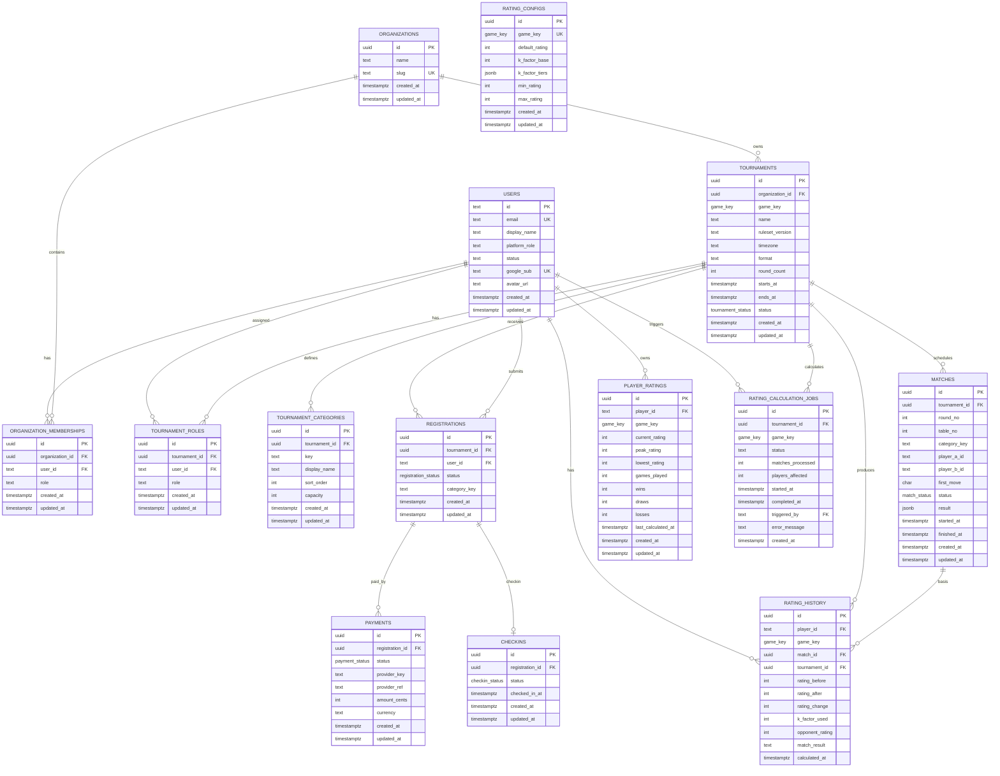

# 資料庫關聯圖與資料結構說明

> 本文件依據 `db/schema/otc.sql`、`db/schema/rating.sql` 與目前 API repository 層整理。目的偏向「給人看的系統理解文件」，不是 migration 規格書。

## 1. 整體資料模型

OneGo 目前以 PostgreSQL 作為主要資料庫，資料模型可分為四個區塊：

- **身份與權限**：`users`、`organizations`、`organization_memberships`、`tournament_roles`
- **賽事核心**：`tournaments`、`tournament_categories`、`matches`
- **報名流程**：`registrations`、`payments`、`checkins`
- **等級分系統**：`rating_configs`、`player_ratings`、`rating_history`、`rating_calculation_jobs`

目前 schema 以可重複套用的 SQL 檔維護：

- `db/schema/otc.sql`：核心賽事、報名、付款、報到、權限資料表
- `db/schema/rating.sql`：ELO 等級分相關資料表，依賴 `otc.sql` 先建立的 `game_key`、`users`、`tournaments`、`matches`

## 2. ERD 關聯圖



## 3. Enum 與狀態

### `game_key`

支援棋種：

- `go`
- `chess`
- `xiangqi`
- `gomoku`

### `tournament_status`

賽事主流程：

- `draft`：草稿，可編輯基本設定
- `published`：已公開，可供使用者查看與報名
- `checkin_open`：開放報到
- `pairing_ready`：報到與名單鎖定，可產生配對
- `in_progress`：比賽進行中
- `closed`：賽事結束
- `cancelled`：賽事取消

### `match_status`

- `scheduled`
- `playing`
- `finished`
- `void`

### `registration_status`

- `created`
- `awaiting_payment`
- `paid`
- `cancelled`
- `refunded`

### `payment_status`

- `initiated`
- `pending`
- `succeeded`
- `failed`
- `cancelled`
- `refunded`

### `checkin_status`

- `not_checked_in`
- `checked_in`
- `withdrawn`
- `replaced`

## 4. 資料表說明

### 4.1 `users`

使用者主檔。`id` 使用 `text`，原因是早期 MVP 支援 `x-user-id` 模擬登入，同時目前 Google OAuth 建立的新使用者會以 UUID 字串存入。

重要欄位：

- `email`：唯一，可為空
- `display_name`：顯示名稱
- `platform_role`：平台層級角色，目前以 `platform_admin` 表示平台總管
- `status`：帳號狀態，目前語意為 `active` / `suspended`
- `google_sub`：Google OAuth sub，唯一
- `avatar_url`：頭像 URL

被參照關係：

- `organization_memberships.user_id`
- `tournament_roles.user_id`
- `registrations.user_id`
- `player_ratings.player_id`
- `rating_history.player_id`
- `rating_calculation_jobs.triggered_by`

### 4.2 `organizations`

主辦單位，也是目前的多租戶邊界。一個組織可以建立多個賽事。

重要欄位：

- `name`：主辦名稱
- `slug`：唯一短代碼，適合未來公開網址或搜尋使用

刪除行為：

- 被 `tournaments.organization_id` 以 `ON DELETE RESTRICT` 參照，因此已有賽事的組織不可直接刪除
- 被 `organization_memberships.organization_id` 以 `ON DELETE CASCADE` 參照，刪除組織時成員關係會一併刪除

### 4.3 `organization_memberships`

使用者在某個組織內的角色。這是組織層級權限，不等於平台總管，也不等於賽事裁判。

重要欄位：

- `organization_id`
- `user_id`
- `role`：目前為文字欄位，程式碼語意使用 `owner`、`admin`、`staff`

重要限制：

- `unique (organization_id, user_id)`：同一使用者在同一組織只能有一筆組織角色

### 4.4 `tournaments`

賽事核心資料表。負責記錄賽事本體、棋種、賽制、時間、狀態與所屬組織。

重要欄位：

- `organization_id`：所屬主辦
- `game_key`：棋種
- `ruleset_version`：規則版本，目前預設 `v1`
- `timezone`：賽事時區
- `format`：賽制，例如 swiss、round_robin、single_elim 等，目前仍為文字欄位
- `round_count`：輪次數
- `starts_at` / `ends_at`：賽事時間區間
- `status`：賽事狀態

刪除行為：

- 刪除賽事會 cascade 刪除 `tournament_roles`、`tournament_categories`、`matches`、`registrations`、`rating_calculation_jobs`
- `rating_history.tournament_id` 是 `ON DELETE SET NULL`，因此歷史等級分紀錄會保留，但會失去賽事連結

### 4.5 `tournament_roles`

賽事層級的角色指派，例如 organizer、staff、referee。適合用於「某位使用者只在某場賽事擔任裁判」這類情境。

重要限制：

- `unique (tournament_id, user_id, role)`：同一使用者不可在同一賽事重複取得同一角色

目前索引：

- `idx_tournament_roles_tournament`
- `idx_tournament_roles_user`

### 4.6 `tournament_categories`

賽事組別定義，例如段位組、級位組、公開組。報名與對局目前以 `category_key` 儲存組別 key。

重要欄位：

- `key`：組別 key，在同一賽事內唯一
- `display_name`：顯示名稱
- `sort_order`：排序
- `capacity`：名額上限，可為空

重要限制：

- `unique (tournament_id, key)`：同一賽事內組別 key 不可重複

注意：

- `registrations.category_key` 和 `matches.category_key` 目前沒有資料庫 FK 約束到 `tournament_categories`，是應用層語意關聯。

### 4.7 `registrations`

報名資料。每筆代表某個使用者報名某場賽事。

重要欄位：

- `tournament_id`
- `user_id`
- `status`
- `category_key`：所報名組別

重要限制：

- `unique (tournament_id, user_id)`：同一使用者同一賽事只能有一筆報名

刪除行為：

- 賽事刪除時報名 cascade 刪除
- 使用者被報名引用時 `ON DELETE RESTRICT`，避免刪除使用者造成報名失去主體
- 報名刪除時會 cascade 刪除付款與報到資料

### 4.8 `payments`

付款資料。設計上將付款供應商細節隔離在 `provider_key` / `provider_ref`，避免付款系統侵入賽事核心。

重要欄位：

- `registration_id`
- `status`
- `provider_key`：例如 mock、stripe、ecpay
- `provider_ref`：外部付款系統參考
- `amount_cents`
- `currency`

目前一筆報名可有多筆付款紀錄，適合支援重試、付款失敗後重新付款、退款紀錄等場景。

### 4.9 `checkins`

報到資料。每筆報名最多一筆報到資料。

重要欄位：

- `registration_id`
- `status`
- `checked_in_at`

重要限制：

- `registration_id unique`：一筆報名只能有一筆報到狀態

### 4.10 `matches`

對局資料。每筆代表一場賽事中的單場對局。

重要欄位：

- `tournament_id`
- `round_no`
- `table_no`
- `category_key`
- `player_a_id` / `player_b_id`
- `first_move`：`A` / `B`，可為空
- `status`
- `result`：JSONB，儲存由 rules package 正規化後的結果
- `started_at` / `finished_at`

重要限制：

- `player_a_id <> player_b_id`
- `round_no > 0`

目前索引：

- `idx_matches_tournament_round`

注意：

- `player_a_id` / `player_b_id` 目前沒有 FK 到 `users(id)` 或 `registrations(id)`。這讓配對資料較彈性，但資料庫不會阻擋不存在的選手 ID。
- `category_key` 目前沒有 FK 到 `tournament_categories`。
- `result` 是 JSONB，schema 由規則外掛與應用層負責校驗。

### 4.11 `rating_configs`

每個棋種一組 ELO 設定。

重要欄位：

- `game_key`：唯一
- `default_rating`
- `k_factor_base`
- `k_factor_tiers`：JSONB，描述不同分段的 K 值
- `min_rating`
- `max_rating`

### 4.12 `player_ratings`

使用者在每個棋種的目前等級分彙總。

重要欄位：

- `player_id`
- `game_key`
- `current_rating`
- `peak_rating`
- `lowest_rating`
- `games_played`
- `wins` / `draws` / `losses`
- `last_calculated_at`

重要限制：

- `unique (player_id, game_key)`：一位使用者在一個棋種只有一筆目前 rating

目前索引：

- `idx_player_ratings_leaderboard (game_key, current_rating desc)`：支援排行榜查詢

### 4.13 `rating_history`

等級分變化流水帳。每次因對局計算造成的 rating 變化都應追加一筆。

重要欄位：

- `player_id`
- `game_key`
- `match_id`
- `tournament_id`
- `rating_before`
- `rating_after`
- `rating_change`
- `k_factor_used`
- `opponent_rating`
- `match_result`
- `calculated_at`

刪除行為：

- 使用者刪除時 cascade 刪除 rating history
- 對局或賽事刪除時，`match_id` / `tournament_id` 會 `SET NULL`，歷史分數變動仍保留

### 4.14 `rating_calculation_jobs`

等級分計算任務紀錄。用來追蹤某場賽事、某棋種的 rating 計算是否完成、處理幾場對局、影響幾位棋手。

重要欄位：

- `tournament_id`
- `game_key`
- `status`：目前為文字欄位，程式碼語意使用 `pending`、`processing`、`completed`、`failed`
- `matches_processed`
- `players_affected`
- `triggered_by`
- `error_message`

目前應用層會查詢是否已有 completed job，避免同一賽事重複完成計算。

## 5. 主要資料流程

### 5.1 主辦與權限

1. 使用者建立或登入後進入 `users`
2. 平台總管可管理 `organizations`
3. 使用者透過 `organization_memberships` 取得某組織的 owner/admin/staff 角色
4. 賽事層級的裁判或工作人員透過 `tournament_roles` 指派

### 5.2 賽事建立到開賽

1. 組織建立 `tournaments`
2. 主辦可建立 `tournament_categories`
3. 賽事公開後，使用者建立 `registrations`
4. 需要付款時建立 `payments`，付款成功後更新報名狀態
5. 開放報到後建立或更新 `checkins`
6. 名單鎖定後產生 `matches`

### 5.3 對局與成績

1. `matches` 儲存輪次、桌次、雙方、先手、狀態
2. 裁判或系統寫入 `result` JSONB
3. 對局完成後 `status = finished`，並設定 `finished_at`
4. 排名與積分應由 matches/result 計算產生，不直接寫死在 match 欄位

### 5.4 等級分

1. 每棋種可有一筆 `rating_configs`
2. 計算任務建立 `rating_calculation_jobs`
3. 根據 finished matches 產生每位選手的 rating 變化
4. 更新 `player_ratings`
5. 追加 `rating_history`
6. 任務完成後標記 job 為 `completed`

## 6. 目前資料完整性邊界

### 已由資料庫保護

- 組織 slug 唯一
- 使用者 email / google_sub 唯一
- 同一使用者在同一組織只能有一筆 membership
- 同一使用者在同一賽事不可重複報名
- 同一賽事內組別 key 唯一
- 一筆報名最多一筆 checkin
- 同一玩家同一棋種只有一筆目前 rating
- 對局不可自己對自己
- 對局輪次必須大於 0
- 多數核心父子關係已有 FK 與 cascade/restrict/set null 行為

### 目前主要依賴應用層保護

- `organization_memberships.role` 的合法值
- `tournament_roles.role` 的合法值
- `users.status` / `users.platform_role` 的合法值
- `tournaments.format` 的合法值
- `rating_calculation_jobs.status` 的合法值
- `payments.currency`、`provider_key` 的合法值
- `matches.player_a_id` / `player_b_id` 是否為有效參賽者
- `matches.category_key`、`registrations.category_key` 是否存在於該賽事組別
- `matches.result` JSONB schema 是否符合該棋種規則
- 裁判跨賽事指派時的時間重疊檢查
- 報名人數是否超過 `tournament_categories.capacity`
- 已完成 rating 計算後是否完全禁止重算，目前由應用層查 completed job 控制

## 7. 設計優化建議

### 7.1 將常用文字狀態收斂為 enum 或 check constraint

目前部分欄位仍是 text，例如：

- `organization_memberships.role`
- `tournament_roles.role`
- `users.status`
- `users.platform_role`
- `tournaments.format`
- `rating_calculation_jobs.status`

建議至少先加 `CHECK` constraint，若未來需要跨 DB 或更高彈性，可保留 text + check；若狀態集合穩定，則改為 PostgreSQL enum。

效益：

- 防止拼字錯誤造成權限或流程異常
- 減少 API 層防呆負擔
- 讓資料庫本身更能描述領域規則

### 7.2 強化組別關聯

目前 `registrations.category_key` 與 `matches.category_key` 是文字欄位，語意上對應 `(tournament_id, tournament_categories.key)`，但沒有 FK。

可選方案：

- 保留 `category_key`，新增複合 FK：`(tournament_id, category_key)` references `tournament_categories(tournament_id, key)`
- 或改存 `category_id uuid`，直接 references `tournament_categories(id)`

建議：

- 若組別 key 是對外 API 與匯入匯出的穩定識別，使用複合 FK
- 若後台管理與內部一致性優先，使用 `category_id`

### 7.3 明確定義 match 參賽者來源

目前 `matches.player_a_id` / `player_b_id` 是 text，沒有 FK。這對 MVP 彈性高，但長期會遇到：

- 對局可能引用不存在的使用者
- 對局選手可能未報名該賽事
- 選手換組後，舊對局 category 與報名 category 不一致

可選方案：

- 方案 A：`player_a_id` / `player_b_id` references `users(id)`，並由應用層確認已報名
- 方案 B：改成 `registration_a_id` / `registration_b_id` references `registrations(id)`
- 方案 C：新增 `participants` 表，將「有效參賽者」從報名、付款、報到狀態中固化出來，match references participants

建議中長期採用方案 C。`participants` 可以處理代打、退賽、替補、隊伍賽、匿名選手等更複雜情境，也能讓配對模組不用直接讀報名流程的細節。

### 7.4 為高頻查詢補索引

目前已有部分索引，但可以依 API 查詢補強：

- `registrations(tournament_id, status)`
- `registrations(user_id, created_at desc)`
- `registrations(tournament_id, category_key, status)`
- `payments(registration_id, status)`
- `checkins(status)`
- `tournaments(organization_id, status, created_at desc)`
- `tournaments(status, game_key, created_at desc)`：公開賽事列表
- `matches(tournament_id, category_key, round_no)`
- `rating_calculation_jobs(tournament_id, game_key, status)` 已有，可考慮加唯一條件索引防 completed 重複

### 7.5 為 `updated_at` 建立自動更新機制

目前多數 repository 手動寫 `updated_at = now()`。建議改用 PostgreSQL trigger 統一處理。

效益：

- 避免新增 repository function 時漏更新
- 降低應用層重複 SQL
- 資料更新時間一致性更高

### 7.6 建立正式 migration 流程

目前 schema 採 idempotent SQL，可快速重複套用，適合 MVP。但資料庫進入正式環境後，建議導入 migration 工具或版本化流程，例如：

- node-pg-migrate
- Drizzle migrations
- Prisma migrations
- Sqitch
- Flyway

目標不是換 ORM，而是讓每次 schema 變更可追蹤、可回滾、可審查。

### 7.7 拆分付款事件與付款狀態

目前 `payments` 同時承載付款狀態與供應商參考。若未來接 ECPay、Stripe、Line Pay 等真實金流，建議新增：

- `payment_events`：記錄 provider webhook 原始事件、處理狀態、冪等 key
- `payment_refunds`：記錄退款申請與結果
- `provider_payload jsonb`：必要時保存供應商回傳內容

效益：

- webhook 可冪等處理
- 出問題時容易追查
- 退款與付款生命週期不會混在單一 row

### 7.8 為 `matches.result` 加上最小資料庫約束

`result` 使用 JSONB 是合理的，因為不同棋種結果 schema 可能不同。不過仍可加最小 check：

- finished match 必須有 result
- non-finished match 不一定有 result
- `first_move` 限制在 `A` / `B`

例如：

```sql
alter table matches
  add constraint matches_first_move_valid
  check (first_move is null or first_move in ('A', 'B'));

alter table matches
  add constraint matches_finished_requires_result
  check (status <> 'finished' or result is not null);
```

### 7.9 防止 rating 重複入帳

目前應用層會查詢 completed job 來避免重複計算。建議加資料庫層防線：

```sql
create unique index if not exists uq_completed_rating_job
on rating_calculation_jobs(tournament_id, game_key)
where status = 'completed';
```

也可考慮在 `rating_history` 增加：

- `job_id`
- `unique (job_id, player_id, match_id)`

如此可追蹤每次計算任務實際產生哪些 rating 變化。

### 7.10 裁判時間衝突可升級為資料庫可檢查模型

目前裁判跨賽事時間重疊由應用層檢查。若這是重要需求，可考慮：

- 使用 PostgreSQL range type，例如 `tstzrange(starts_at, ends_at)`
- 在 tournament role 指派時檢查同一 user 的 referee/staff 賽事時間是否 overlap
- 若資料模型調整為「指派表含時間區段」，可用 exclusion constraint 做更強保護

### 7.11 軟刪除與稽核紀錄

目前多數刪除是硬刪除。正式營運後，以下資料建議避免直接刪除：

- users
- organizations
- tournaments
- registrations
- payments
- matches

可加入：

- `deleted_at`
- `deleted_by`
- audit log table

尤其付款、報名、對局結果與 rating history 通常有稽核價值，硬刪除會讓事後追查困難。

### 7.12 整理 ID 型別策略

目前 `users.id` 是 `text`，其他主要實體多為 `uuid`。這是合理的 MVP 折衷，但長期應明確定義：

- 使用者 ID 是否永遠允許外部字串
- Google OAuth 使用者是否統一使用內部 UUID
- 測試帳號與 seed 帳號是否仍需要可讀字串 ID

若要維持 `text`，建議文件化命名規則；若要統一 UUID，則需要規劃 migration 與相容層。

## 8. 建議優先順序

### P0：低成本、高保護

- 為 text 狀態欄位加 `CHECK` constraint
- 為 `matches.first_move` 加合法值限制
- 為 finished match 加 result 必填限制
- 為 completed rating job 加 partial unique index
- 補常用查詢索引

### P1：改善資料一致性

- 強化 `category_key` FK
- 明確 match player 是 user、registration 還是 participant
- 建立 `participants` 表，讓配對、報到、退賽、替補的邊界更清楚
- `updated_at` 改用 trigger

### P2：正式營運與可追溯性

- 導入 migration 工具
- 新增 payment events / refunds
- 新增 audit log 與軟刪除
- rating history 連到 calculation job
- 裁判時間衝突升級為更強的資料庫或交易層約束

## 9. 小結

目前資料模型的核心方向是清楚的：`organizations -> tournaments -> registrations/matches` 是主軸，權限分為平台、組織、賽事三層，rating 系統則獨立在賽後計算。這個設計適合 MVP 快速推進，也保留了多棋種、多主辦、多組別的擴充空間。

下一階段最值得優先處理的是「資料庫層的基本防呆」與「參賽者模型」。前者能快速降低髒資料風險；後者會決定後續配對、退賽、替補、分組、成績與 rating 的穩定性。
